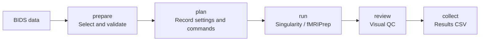

# fmri-prep-flow

A Singularity-based fMRI preprocessing workflow powered by **fMRIPrep 25.2.5**.

Process BIDS T1w and BOLD data with input validation, recorded execution plans,
per-acquisition output checks, QC plots, and a CSV catalog of results.



## Scope

- Single-echo and multi-echo BOLD with a fixed TR; multiple subjects, sessions, tasks, and runs.
- Raw T1w images are required for each selected session. Anatomical references are built per session, and container jobs run sequentially by subject.
- BOLD images and masks in `T1w` and `MNI152NLin2009cAsym:res-2` spaces, plus confounds, transforms, and reports.
- NIfTI-to-BIDS conversion, FreeSurfer surfaces, CIFTI, temporal denoising, smoothing, GLM, and functional connectivity analysis are outside the scope of this tool.

This is an independent workflow wrapper. Image processing is performed by [fMRIPrep](https://fmriprep.org/).

## Installation

Requirements: Linux, Python ≥ 3.10, a working Singularity installation, and your own FreeSurfer license.
Run these commands from the repository root:

```bash
python -m venv .venv
source .venv/bin/activate
pip install -e '.[validator]'
singularity --version
export FS_LICENSE=/absolute/path/to/license.txt
fmri-prep-flow --version
```

The container image is pinned to an OCI SHA256 digest. The first run downloads the image and TemplateFlow templates as needed. The `docker://` URI identifies the image source; a Docker daemon is not required.

## Quick start

### 1. Select inputs and processing settings

```bash
fmri-prep-flow init --output project
```

Edit the generated `project/selection.json`:

```json
{
  "source_bids": "/data/my-bids",
  "subjects": ["001", "002"],
  "tasks": ["rest"]
}
```

Use labels without prefixes such as `sub-` or `ses-`. Optional filters include `sessions`, `runs`, `acquisitions`, and `directions`; omitted filters match all values. Multi-echo acquisitions are always selected as complete echo groups. Replace the example paths and labels with those from your dataset.

Edit `project/config.json` to choose a susceptibility distortion correction (SDC) policy:

| `sdc` | Behavior |
| --- | --- |
| `auto` (default) | Requires complete, correctly associated, supported fieldmaps. Planning fails if they are unavailable. |
| `syn` | Explicitly requests anatomy-based SyN correction. This wrapper requires valid `PhaseEncodingDirection` and `TotalReadoutTime` metadata. |
| `none` | Disables distortion correction. An explanation in `sdc_reason` is required. |

**SyN is not enabled by default.** `auto` does not fall back to SyN or silently disable SDC. Use acquisition metadata from the dataset rather than guessing missing values. See the [configuration reference](docs/configuration.md) for all options.

### 2. Prepare and run

```bash
fmri-prep-flow prepare --selection project/selection.json --output project/prepared
fmri-prep-flow doctor --config project/config.json
fmri-prep-flow plan --staging project/prepared/staging.json \
  --config project/config.json --output project/run-01
fmri-prep-flow run --plan project/run-01/plan.json
fmri-prep-flow status --plan project/run-01/plan.json
```

`prepare` creates an independent BIDS copy and runs the official validator. `plan` records the commands and input hashes; `run` verifies the plan and executes it in the foreground. Use Slurm or tmux to manage jobs on a server. After a failure, retain the existing run for inspection and create a new output directory to retry.

### 3. Review and export

Open `project/run-01/sub-*/derivatives/sub-*.html` and the plots in `project/run-01/products/*/qc/`. Inspect brain extraction, alignment, distortion, signal dropout, and motion before completing the review form:

```bash
fmri-prep-flow review --plan project/run-01/plan.json --template project/review-form.json
# Inspect the reports and fill in reviewer, checks, decision, and notes.
fmri-prep-flow review --plan project/run-01/plan.json --review project/review-form.json
fmri-prep-flow collect --plan project/run-01/plan.json --output project/catalog.csv
```

Processing completion and human QC are tracked separately. You can export a CSV before submitting a review; its QC status will remain `pending`. Images are never automatically approved. Each CSV row describes one acquisition in one output space.

## Repository layout

```text
src/fmri_prep_flow/
├── cli.py        Argument parsing and command dispatch
├── config.py     Configuration defaults and validation
├── models.py     BIDS acquisition identities
├── inputs/       Selection, audit, staging, and BIDS validation
├── pipeline/     Policies, Singularity commands, planning, and execution
├── outputs/      Output checks, QC plots, human review, and CSV export
└── common/       File I/O, hashes, and environment records
```

Detailed documentation is currently in Chinese:

- [Configuration reference](docs/configuration.md)
- [Processing protocol and visual QC](docs/protocol.md)
- [Code reading guide](docs/reading-guide.md)
- [Validation evidence and known limitations](docs/validation.md)
- [Development and testing](CONTRIBUTING.md)

The repository contains code, documentation, examples, and tests using synthetic data. Imaging data, containers, caches, licenses, and participant reports are managed locally.

## License and citation

This repository is distributed under the [MIT License](LICENSE). fMRIPrep, software bundled in its container, and input datasets retain their respective licenses.

For publications, cite fMRIPrep and the tools used in your run. Use the generated `logs/CITATION.md` as a starting point, and report the workflow version, container version, and correction settings.
