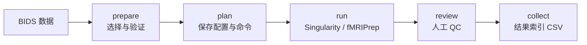

# fmri-prep-flow

A Singularity-based fMRI preprocessing workflow powered by fMRIPrep.

用 **Singularity + fMRIPrep 25.2.5** 处理 BIDS 格式的 T1w 和 BOLD 数据，提供输入检查、可追溯的执行计划、逐次采集的产物检查、QC 图和结果 CSV。



## 支持范围

- 单回波和多回波、固定 TR 的 BOLD；支持多个被试、session、task 和 run。
- 每个选定 session 需要原始 T1w；按 session 建立解剖参考，按被试顺序执行容器任务。
- 输出 `T1w` 和 `MNI152NLin2009cAsym:res-2` 空间的 BOLD、掩膜、confounds、变换和报告。
- 不包含裸 NIfTI 转 BIDS、FreeSurfer 表面、CIFTI、时序去噪、平滑、GLM 或功能连接分析。

这是独立的流程封装，实际影像处理由 [fMRIPrep](https://fmriprep.org/) 完成。

## 安装

需要 Linux、Python ≥ 3.10、可运行容器的 Singularity 和自己的 FreeSurfer license。
在仓库根目录执行：

```bash
python -m venv .venv
source .venv/bin/activate
pip install -e '.[validator]'
singularity --version
export FS_LICENSE=/absolute/path/to/license.txt
fmri-prep-flow --version
```

镜像固定到 OCI SHA256 摘要。首次运行需要下载镜像与 TemplateFlow 模板；命令中的 `docker://` 是镜像来源，不需要 Docker 服务。

## 快速开始

### 1. 选择数据和处理策略

```bash
fmri-prep-flow init --output project
```

编辑生成的 `project/selection.json`：

```json
{
  "source_bids": "/data/my-bids",
  "subjects": ["001", "002"],
  "tasks": ["rest"]
}
```

标签不带 `sub-`、`ses-`。还可以指定 `sessions`、`runs`、`acquisitions`、`directions`；省略的条件匹配全部，多回波始终整组选择。示例路径和标签需要替换成自己的数据。

编辑 `project/config.json`，选择畸变矫正策略：

| `sdc` | 适用条件 |
| --- | --- |
| `auto`（默认） | 有完整、关联正确且受支持的场图；没有则阻止计划。 |
| `syn` | 明确选择基于解剖的校正；本工具要求真实的相位编码方向和总读出时间。 |
| `none` | 研究方案明确不做畸变矫正；必须填写 `sdc_reason`。 |

不要为了通过检查而猜测采集参数。完整选项见 [配置说明](docs/configuration.md)。

### 2. 准备并运行

```bash
fmri-prep-flow prepare --selection project/selection.json --output project/prepared
fmri-prep-flow doctor --config project/config.json
fmri-prep-flow plan --staging project/prepared/staging.json \
  --config project/config.json --output project/run-01
fmri-prep-flow run --plan project/run-01/plan.json
fmri-prep-flow status --plan project/run-01/plan.json
```

`prepare` 创建独立的 BIDS 副本并运行官方验证器。`plan` 保存实际命令和输入哈希；`run` 检查计划后在前台执行。服务器上可用 Slurm 或 tmux 管理作业。失败后保留现场，使用新输出目录重试。

### 3. 检查结果并导出

打开 `project/run-01/sub-*/derivatives/sub-*.html` 和 `project/run-01/products/*/qc/`，检查脑提取、配准、畸变、信号缺失和头动，再填写 review 表单：

```bash
fmri-prep-flow review --plan project/run-01/plan.json --template project/review-form.json
# 查看报告，填写 reviewer、各项 checks、decision 和 notes。
fmri-prep-flow review --plan project/run-01/plan.json --review project/review-form.json
fmri-prep-flow collect --plan project/run-01/plan.json --output project/catalog.csv
```

运行成功和人工 QC 是独立状态。未提交 review 也可导出 CSV，其中明确标记 `pending`；工具不会自动批准影像。CSV 每行对应一次采集的一个输出空间。

## 仓库结构

```text
src/fmri_prep_flow/
├── cli.py        命令行参数与函数分发
├── config.py     配置默认值与检查
├── models.py     BIDS 采集身份
├── inputs/       数据选择、审计、复制、BIDS 验证
├── pipeline/     处理策略、Singularity 命令、计划与执行
├── outputs/      产物检查、QC 图、人工审核、CSV
└── common/       文件读写、哈希、环境记录
```

- [处理 protocol 与人工 QC](docs/protocol.md)
- [按调用顺序读代码](docs/reading-guide.md)
- [验证范围与已知限制](docs/validation.md)
- [开发与测试](CONTRIBUTING.md)

仓库只包含代码、文档、示例和合成数据测试。影像、容器、缓存、license 和个体报告由用户在本地管理。

## License 与引用

本仓库代码使用 [MIT License](LICENSE)。fMRIPrep、容器内软件和输入数据各自遵循其许可。
论文方法应引用实际使用的 fMRIPrep 及相关工具；优先使用运行结果中的 `logs/CITATION.md`，并报告本流程版本、容器版本和校正策略。
